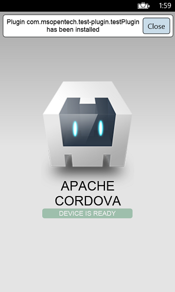

# Simple demo plugin for Apache Cordova apps

This plugin demonstrates experience of adding new plugin to your Apache Cordova Application.

It adds small banner to your main page with plugin name. The banner could be closed after clicking on that button.

Below is the result of adding plugin to Cordova HelloWorld app:

## Supported platforms

The plugin doesn't contain any platform-dependent code and will work on any platform that Cordova supports. It has been tested on:

  * Android
  * iOS
  * Windows
  * WP8
  * Browser

## Installation Instructions

### Prerequisites

* [NodeJS and NPM](https://nodejs.org/)

* [Cordova CLI](https://cordova.apache.org/)

  Cordova CLI can be easily installed via NPM package manager: `npm install -g cordova`

* Additional prerequisites for each target platform can be found at [Cordova platforms documentation](http://cordova.apache.org/docs/en/edge/guide_platforms_index.md.html#Platform%20Guides) page.

### Using Cordova CLI

  * Create a project and add the platforms you want to support

    `cordova create TestPluginSample`

    `cd TestPluginSample`

    `cordova platform add android`

    `cordova platform add ios`

    `cordova platform add windows`

  * Add the plugin to your project

    `cordova plugin add https://github.com/MSOpenTech/cordova-plugin-test.git`

  * Build and run application: `cordova run`.

## Copyrights ##

Copyright (c) Microsoft Open Technologies, Inc. All rights reserved.

Licensed under the Apache License, Version 2.0 (the "License"); you may not use these files except in compliance with the License. You may obtain a copy of the License at

http://www.apache.org/licenses/LICENSE-2.0

Unless required by applicable law or agreed to in writing, software distributed under the License is distributed on an "AS IS" BASIS, WITHOUT WARRANTIES OR CONDITIONS OF ANY KIND, either express or implied. See the License for the specific language governing permissions and limitations under the License.
